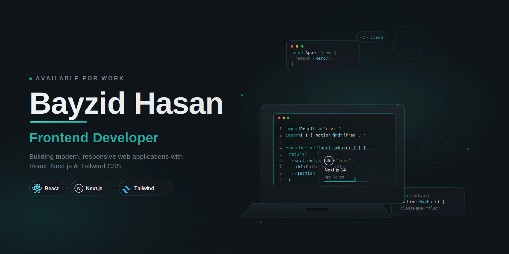

  

  

  
  

---

## 🎯 About Me

I'm a frontend developer based in Bangladesh who enjoys building modern, responsive web applications.

I mainly work with React, Next.js and Tailwind CSS. Currently, I'm learning backend development to become a full-stack MERN developer.

I enjoy solving real-world problems by building practical projects and continuously improving my development skills.

---

## 🛠️ Skills & Tools

  

---

## 📌 What I'm Currently Working On

- 🚀 Improving my personal portfolio
- 🌱 Learning backend development with Node.js & Express
- 📚 Exploring authentication and databases
- 🤝 Looking for open-source contribution opportunities

---

## 🔗 Connect With Me

  
  
  

  

  

---

## 🚀 Featured Projects

### 🌐 Portfolio Website

Modern portfolio built with Next.js and Tailwind CSS.

**Tech Stack:** Next.js • React • Tailwind CSS • Framer Motion

- 🔗 **Live:** https://bayzid-dev.vercel.app
- 💻 **Source:** https://github.com/dev-bayzid/Portfolio

---

### 🫂 KeenKeeper — Friendship Relationship Tracker

A modern friendship management web application built with **Next.js, React, and Tailwind CSS** that helps users maintain meaningful relationships by tracking communication history, upcoming contact goals, and interaction analytics.

**Tech Stack:** Next.js • React • Tailwind CSS • Recharts • Context API

- 🌐 **Live Demo:** https://keen-keeper-ten-puce.vercel.app/
- 💻 **Source Code:** https://github.com/dev-bayzid/Keen-keeper

---

### 📚 Book Vibe

A modern book management web application built with **React.js and Tailwind CSS** that allows users to explore books, view detailed information, and organize their reading journey with an intuitive and responsive interface.

**Tech Stack:** React • React Router • Tailwind CSS • DaisyUI

- 🌐 **Live Demo:** https://books-vibe-read-books.netlify.app/
- 💻 **Source Code:** https://github.com/dev-bayzid/book-vibe

---

## 📊 GitHub Statistics

  

  

  

---

## 📈 Contribution Graph

  

---

If you like my work, consider giving a ⭐ to my repositories or connecting with me on LinkedIn.

  

